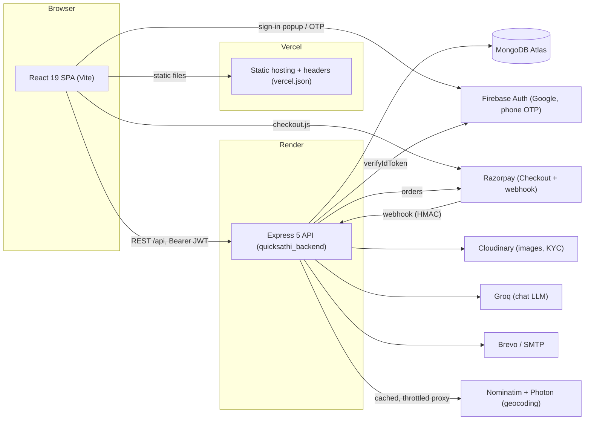
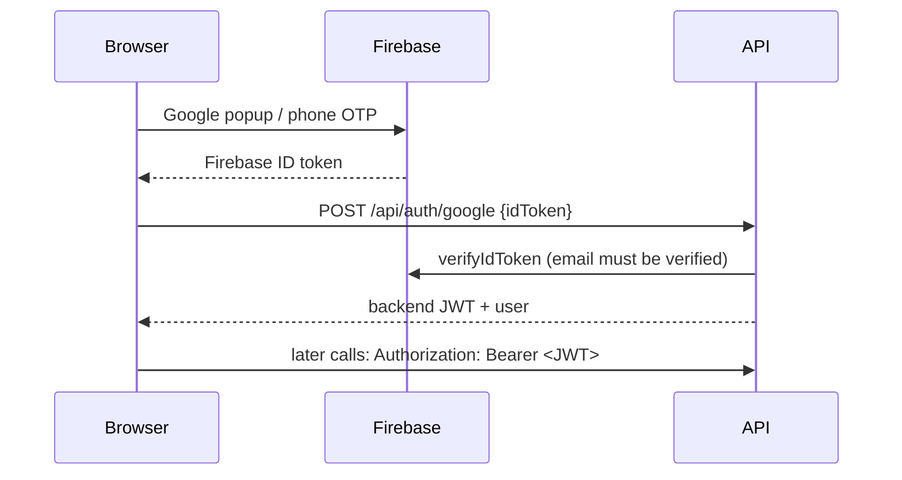
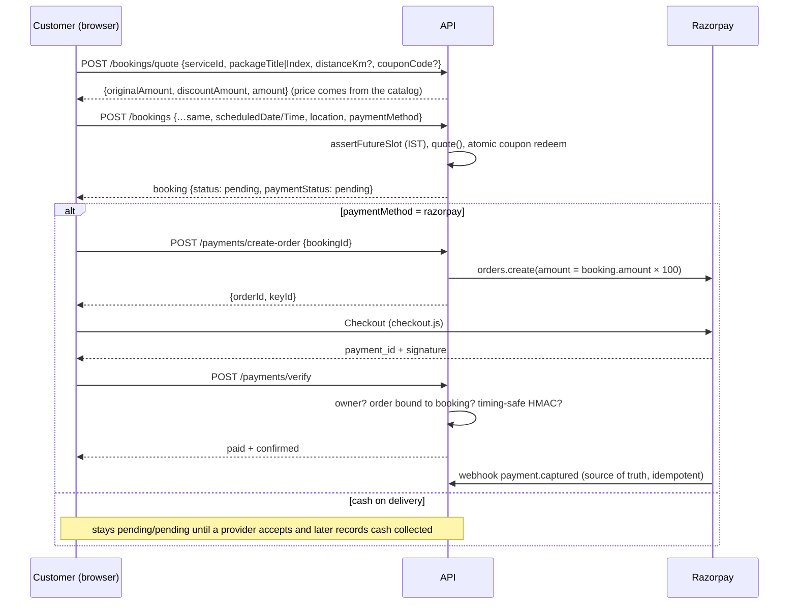

# TiptoBook — Architecture

Internal reference for developers. For vocabulary see [CONTEXT.md](./CONTEXT.md); for *why* things are the way they are see [docs/adr/](./docs/adr/); for the history of the security/ops overhaul see [docs/developer-walkthrough.md](./docs/developer-walkthrough.md).

The product is a marketplace for local services in India (home repair, AC, salon, weddings, car rental, tuition, pandit…). Customers book a **service**, pay online or in cash, and a verified **provider** does the job. Admins run the catalog, approve providers and handle exceptions. (The repo and some identifiers still say "QuickSathi"; the brand is TiptoBook.)

## 1. System at a glance



- **Frontend** `quicksathi_frontend/` — React 19, React Router 7, Tailwind 4, Framer Motion, Leaflet. Client-rendered SPA (no SSR). Deployed on Vercel.
- **Backend** `quicksathi_backend/` — Node ≥ 20, Express 5, Mongoose 8, ES modules. Deployed on Render. No build step.
- **Database** MongoDB Atlas. One database per environment (see §9).

## 2. Repository map

```
quicksathi_backend/
  server.js            app wiring: env check → security middleware → body parsers → rate limits → routes → error handler
  config/              db.js (connect), firebase.js (Admin SDK), validateEnv.js (boot-time config check)
  middleware/          auth.js (protect, generateToken), admin.js (adminOnly, providerOnly), rateLimits.js
  models/              Mongoose schemas: User, Provider, Category, Service, Booking, Coupon, Banner, Notification, Contact
  routes/              one router per area (auth, bookings, payments, providers, admin, services, categories, coupons,
                       banners, contact, notifications, ai, geo)
  services/            business rules shared by routes: pricing.js, bookingStatus.js, emailService.js, phone.js
  seed/                dev-only data scripts (guarded) + additive migrations
  scripts/             grant-admin.mjs, generate_sitemap.js, migrations/, upload_to_cloudinary.js
  test/                node:test suites + helpers/stack.mjs (boots the real server on an in-memory MongoDB)
quicksathi_frontend/
  src/config/          api.js (axios instance, cache, 401 handling), firebase.js
  src/context/         AuthContext (session), LocationContext (visitor location)
  src/hooks/           useCatalog (shared categories/services loader), useFetch
  src/pages/           customer pages; src/admin/ admin panel; src/components/ shared UI
  src/utils/           razorpayCheckout.js
docs/                  review, fix plan, ADRs, walkthrough
```

## 3. Request lifecycle (backend)

`server.js`, in order:

1. `config/validateEnv.js` — in production the process **exits** if required configuration is missing or unsafe. `config/firebase.js` likewise exits in production if Firebase Admin can't initialise.
2. `helmet`, `trust proxy = 1`, `compression`, CORS (allow-list + localhost + the project's Vercel preview URLs).
3. Body parsing: `express.raw` for `/api/payments/webhook` (signature needs the exact bytes); `express.json` 10 MB only for `/api/admin/upload` and `/api/providers/register` (base64 images); **100 KB** everywhere else.
4. Rate limits (`middleware/rateLimits.js`): global 600/min/IP; failed credential logins 10/15 min; auth 30/min; contact 5/h; AI chat 20/h; coupon validation 10/min; geocoding 60/min.
5. Routers under `/api/*`. Authenticated routes use `protect` (verifies the JWT **and reloads the user from the DB on every request**, so deactivation and role changes take effect immediately), then `adminOnly` / `providerOnly` where needed.
6. 404, then the error handler: middleware 4xx errors keep their status; unexpected errors are a generic 500 in production.

Routes catch their own errors and still return `error.message` on 500s in places; moving to one central handler is open work.

## 4. Authentication and roles



- Identity comes **only** from a verified Firebase token (`routes/auth.js → verifyFirebaseIdentity`). Request-body email/uid/phone are never trusted. Email+password accounts (`/register`, `/login`) exist alongside.
- The backend issues its own JWT (`JWT_EXPIRES_IN`, default 7d) stored in `localStorage` (`qs_token`) by the SPA.
- Roles: `user` (customer), `provider`, `admin`. Stored on `User.role`.
  - **Admin is never derived from an email address.** Grant it with `node scripts/grant-admin.mjs <email> --yes` or from the admin Users page (target must have a verified email).
  - **Provider** is granted only when an admin approves a provider application (`/api/admin/providers/:id/approve`). Rejecting revokes it.
  - Email and phone can't be edited through the profile endpoint; they are set by sign-in flows.

### Permission matrix (summary)

| Area | Anonymous | Customer | Provider (approved) | Admin |
|---|---|---|---|---|
| Browse catalog, banners, active coupons | ✅ | ✅ | ✅ | ✅ |
| Create booking, pay, cancel own (pending/confirmed) | | ✅ | ✅ | ✅ |
| Change status of **assigned** bookings (legal transitions only) | | | ✅ | |
| Change status of **any** booking | | | | ✅ |
| Mark COD cash collected | | | own jobs | any |
| Edit own provider profile (allow-listed fields) | | | ✅ | |
| Approve/reject providers, manage users, catalog, coupons, banners, broadcasts | | | | ✅ |
| See provider KYC documents | | | | ✅ |

## 5. Booking, pricing and payment



Rules that must stay true (each has tests):

- **The client never sends an amount.** `services/pricing.js` computes the price from `Service.packages[]` / `startingPrice` (rentals: stored `perKmRate` × reported distance, capped). The same `quote()` backs `/bookings/quote`, `/coupons/validate` and `POST /bookings`.
- **Coupons** are validated by one function (`couponProblem`) and redeemed atomically (`findOneAndUpdate` guarded on per-user use and `usageLimit`); a failed booking releases the redemption. An invalid coupon fails the booking rather than being silently ignored.
- **A booking is never created `paid`.** Online bookings become paid only through `/payments/verify` or the webhook; both are idempotent, and the amount in a webhook must equal `booking.amount × 100`.
- **Status changes go through `services/bookingStatus.js`** (one transition map + `statusHistory` audit). Customers may only cancel while `pending`/`confirmed`; providers move `confirmed → in_progress → completed`; admins can also cancel in-progress jobs. `completed` does **not** imply `paid`; cash is recorded by an explicit *cash collected* action. Cancelling a paid booking sets `paymentStatus = refund_pending` (refunds are manual today).
- **Time** is Asia/Kolkata: past-slot validation, coupon "valid until" dates (a date-only value means end of that day IST) and dashboard buckets all use IST.

## 6. Data model

| Model | Purpose / notable fields |
|---|---|
| `User` | `role`, `authProvider`, `emailVerified`, `firebaseUid`, `phone` (E.164), `isActive`, `deletedAt` (soft delete → anonymised). Unique partial indexes on `phone` and `firebaseUid`. |
| `Provider` | One per provider user. `approvalStatus` (`pending/approved/rejected`), `isActive`, `rating`, `documents.*` (**`select: false`**, KYC image URLs). |
| `Category` | `vertical`, `subCategories[]`, `active`, `comingSoon`. |
| `Service` | `slug` (unique), `category`, `packages[]`, `startingPrice`, `serviceMode` (`RENTAL` uses `perKmRate`), `cities[]` (empty = everywhere), `available`, `approvalStatus`. Only `approved && available` services are public. |
| `Booking` | `bookingId` (`QS-…`), `user`, `service`, `provider`, amounts (`originalAmount`, `discountAmount`, `amount`, in rupees), `paymentMethod/Status`, `razorpayOrderId/PaymentId` (unique sparse), `status`, `statusHistory[]`. |
| `Coupon` | `discountType`, `discountValue`, limits, `validFrom/Until`, `usedBy[]`. Validators cap percentage ≤ 100 etc. |
| `Banner` | Homepage/category banners; `link`/`image` must be a site path or `https://`. |
| `Notification`, `Contact` | In-app notifications; contact-form messages. |

Money is stored as rupee numbers (not integer paise) — see "Known limitations".

## 7. Frontend

- `useCatalog({ city })` is the single loader for categories + services: de-duplicated in-flight requests, 5-minute response cache (`config/api.js`), explicit `error` + `retry`. **There is no mock/offline catalog**; pages show loading, empty and error states.
- Prices shown at checkout come from `POST /bookings/quote`, not from the URL (the `?price=` parameter is a display fallback only).
- Payment uses Razorpay Checkout (`utils/razorpayCheckout.js`); a booking created for online payment can be paid later from **My Bookings → Pay now**.
- Location: GPS permission is requested only when the visitor asks ("Use my location") or has already granted it. Typed/picked locations persist; GPS-derived ones for 24 h. Address search/reverse geocoding goes through `/api/geo/*`.
- `ErrorBoundary` wraps the app (and reloads once on a stale-chunk error after a deploy). A 401 on an authenticated call clears the session; login-call 401s are shown as normal errors.

## 8. Cross-cutting concerns

- **Security headers**: helmet on the API; `vercel.json` sets HSTS, Referrer-Policy, Permissions-Policy and a minimal CSP (`frame-ancestors`, `base-uri`, `object-src`, `form-action`). A full script-src CSP is not enabled yet.
- **Email** (`services/emailService.js`): Brevo API, else SMTP. Every user-supplied value is HTML-escaped (`escapeHtml`). In production a missing provider is an error, not a silent mock.
- **Uploads**: admin images and provider KYC arrive as base64 data URIs and are pushed to Cloudinary. KYC accepts PNG/JPG/WebP only, ≤ ~5 MB.
- **AI chat** (`routes/ai.js`): the system prompt is fixed on the server; the client sends only the conversation (user/assistant roles, ≤ 10 messages, ≤ 1000 chars each); falls back to a rule-based answer engine.
- **Geocoding proxy** (`routes/geo.js`): cached 10 min, Nominatim serialised at ≥ 1.1 s spacing, coordinates rounded to ~11 m, proper User-Agent (`GEO_USER_AGENT`).

## 9. Environments and configuration

| Env | Database | Notes |
|---|---|---|
| Local dev | **A separate dev database** (`quicksathi_dev`) | `npm run seed:dev` builds the catalog. Never point a local `.env` at production. |
| Tests | In-memory MongoDB | `test/helpers/stack.mjs` ignores `.env` entirely (`DOTENV_CONFIG_PATH=/dev/null`). |
| Production | Atlas production database | Config lives only in Render; the server refuses to start if it's incomplete. |

Backend variables (`quicksathi_backend/.env.example` is the template):

| Variable | Required in prod | Purpose |
|---|---|---|
| `MONGODB_URI`, `JWT_SECRET` (≥ 32 random chars), `CLIENT_URL` | ✅ | core |
| `FIREBASE_PROJECT_ID`, `FIREBASE_CLIENT_EMAIL`, `FIREBASE_PRIVATE_KEY` | ✅ (exit otherwise) | verify Firebase ID tokens |
| `RAZORPAY_KEY_ID`, `RAZORPAY_KEY_SECRET`, `RAZORPAY_WEBHOOK_SECRET` | ✅ | payments |
| `BREVO_API_KEY` or `SMTP_USER`+`SMTP_PASS` (+ `BREVO_SENDER_*`/`SMTP_SENDER`) | warns | email |
| `CLOUDINARY_*` | warns | uploads |
| `GROQ_API_KEY` | optional | AI chat (else rule-based fallback) |
| `ADMIN_EMAILS` | optional | only used as *recipients* of contact-form emails; **grants no privileges** |
| `GEO_USER_AGENT`, `GEO_NOMINATIM_URL`, `GEO_PHOTON_URL` | optional | geocoding proxy |
| `PORT` | injected by Render | defaults to 5050 locally (5000 clashes with macOS AirPlay) |

Frontend (`quicksathi_frontend/.env.example`): `VITE_API_URL` (defaults to `http://localhost:5050/api`) and the public `VITE_FIREBASE_*` web config. The app runs without a `.env`; Google/phone login are disabled until Firebase is configured.

## 10. Local development, testing and release

```bash
# Backend (uses a dev database in .env)
cd quicksathi_backend && npm ci && npm run seed:dev && npm run dev      # http://localhost:5050
# Frontend
cd quicksathi_frontend && npm ci && npm run dev                          # http://localhost:5173
# Tests (hermetic; first run downloads a mongod binary)
cd quicksathi_backend && npm test
```

CI (`.github/workflows/ci.yml`): backend `npm test` + `npm audit --omit=dev --audit-level=high`; frontend `npm run build` (lint is reported, not yet blocking).

**Release checklist for changes that touch money, auth or data shape**: add/adjust a test through the HTTP API; run `npm test`; for schema/index changes write a migration under `scripts/migrations/` with a dry-run mode (see `001-user-unique-indexes.mjs`); never edit production data by hand without a backup.

## 11. Known limitations (honest list)

- Razorpay was verified by unit tests only; run a real test-mode payment and webhook before launch.
- Refunds are manual (`refund_pending` flag only).
- KYC files are on public (unguessable) Cloudinary URLs; private delivery with signed URLs is planned.
- JWT is kept in `localStorage` (XSS-exposed); a stricter CSP and/or httpOnly cookies would reduce this.
- Money is stored as rupee decimals, not integer paise.
- Rental distance is reported by the browser; the server caps it but doesn't recompute the route.
- Client-rendered SPA: link previews and non-JS crawlers see the homepage head for every URL. Prerendering is future work.
- Several very large components (`Services.jsx`, `Hero.jsx`, `Layout.jsx`, `ProviderOnboarding.jsx`) and eight near-identical category modals need refactoring; ~120 pre-existing lint errors remain.
- Error handling is per-route; a central error handler is open work.
