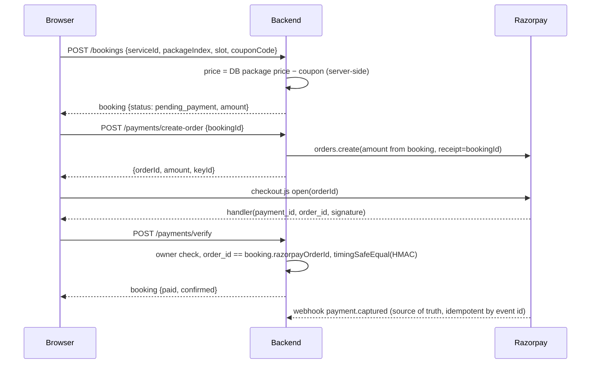

# TiptoBook (QuickSathi) — End-to-End Code Review

**Date:** 2026-10-04 · **Commit:** `e8539b3` · **Scope:** `quicksathi_backend/` (Express 5 + Mongoose), `quicksathi_frontend/` (React 19 + Vite 8), deploy configs, seed/scripts, repo hygiene.

How to use this doc: work top-down. Each item is a checkbox with **where** (file:line), **why it matters**, **fix**, and an **effort** estimate (S < ½ day, M ½–2 days, L > 2 days). Items tagged **🔴 PROVEN** were exploited against the real backend code (in-memory MongoDB, production `NODE_ENV`); see [Appendix A](#appendix-a--live-exploit-probes).

**Fix plan:** [`docs/fix-plan-p0-p1.md`](./fix-plan-p0-p1.md), with work packages, checklists, and an acceptance test suite (`quicksathi_backend/test/`, `npm test`).

| Severity | Meaning | Count |
|---|---|---|
| **P0** | Exploitable security hole, money-integrity break, PII leak, data loss. Fix before taking real customers/money. | 11 |
| **P1** | Real user-facing bug or significant risk. Next sprint. | 24 |
| **P2** | Maintainability, performance, SEO, a11y, missing tests/observability. | 22 |
| **P3** | Cleanup / nice-to-have. | 12 |

---

## 1. Executive summary

**Verdict: not safe to take real payments or onboard real providers yet.** The UI looks finished, but the trust boundary is in the wrong place: identity, price, payment status, and provider approval are all decided by the client.

The five things that matter most:

1. **Anyone can log in as anyone, including an admin**, by sending only an email address to `/api/auth/admin-google` (or `/google`, `/provider-google`). No password or token needed. 🔴 PROVEN
2. **Online payment is fake.** The "Pay ₹X" button waits 1.5 s and then creates a booking the server marks `paid`/`confirmed`. Razorpay is never called. 🔴 PROVEN
3. **The customer sets the price.** It travels in the URL (`?price=`) and the server accepts it. Coupons are also applied twice (UI shows ₹800, DB stores ₹640). 🔴 PROVEN
4. **Provider controls are broken.** A rejected provider can approve themselves. Any provider can mark *any* booking completed+paid. 🔴 PROVEN
5. **Provider KYC (ID proof, selfie, phone, email) is public** at `GET /api/providers` with no login. This is a DPDP Act exposure. 🔴 PROVEN

Everything else (P1/P2) is normal for an MVP: no tests, no rate limiting, mock data mixed into production pages, 729 kB main JS bundle, ~52 MB of unused images deployed, etc.

### Health snapshot (measured)

| Check | Result |
|---|---|
| `npm audit` backend | 13 vulns (6 high, 7 moderate); `firebase-admin` → `@google-cloud/storage` → `uuid`/`qs` chain |
| `npm audit` frontend | 15 vulns (11 high); `react-router-dom 7.15.0` (open-redirect, DoS advisories), `vite 8.0.11` |
| ESLint (frontend) | **123 errors, 11 warnings** in 54 files: 93 `no-unused-vars`, 20 `react-hooks/set-state-in-effect`, 11 `exhaustive-deps` |
| `vite build` | Main chunk `index-*.js` **729 kB (185 kB gzip)**; leaflet 164 kB, framer-motion 133 kB, firebase 118 kB; `dist/` = **76 MB** (public/ = 63 MB) |
| react-doctor | **33/100 (Critical)**, 821 issues: a11y 330, perf 322, bugs 92, maintainability 75 |
| Tests / CI | **None** (no test script, no `.github/`) |
| Secrets in git history | None found (only placeholder keys in `.env.example`) ✅ |

---

## 2. P0 — Launch blockers

### P0-0 Assume-breach check (do this first, same day)
- [ ] **Audit production data for abuse of the holes below, since they may already have been used.** — Effort S
  - Rotate `JWT_SECRET` on Render. This invalidates every issued token, including any forged admin sessions.
  - List `User` docs with `role: "admin"` and confirm each one is legitimate.
  - Find `Booking` docs with `paymentStatus: "paid"` and no `razorpayPaymentId`. Today that is *every* "online" booking (P0-4).
  - Find `Provider` docs with `approvalStatus: "approved"` and no `approvedBy`. Those were self-approved (P0-7).
  - Confirm whether `provider@example.com` (password `password123`) or a provider profile for `nityanand666.nk@gmail.com` exists in prod (see P1-22).
  - Check the Render boot log for the Firebase init line. If Firebase failed to initialise, P0-1 is the *normal* login path, not just an exploit.
  - **Read-only check, 2026-10-05**, against the `MONGODB_URI` in the local backend `.env` (cluster `quick-cluster`, DB `quicksathi`; 13 users, 43 services, 4 bookings — this looks like the live DB):
    - 3 of 4 bookings are `paid` with no `razorpayPaymentId` (2 `razorpay`, 1 `cod`), i.e. not real payments.
    - 1 admin user; 0 approved providers without `approvedBy`; `provider@example.com` does not exist.
    - 1 approved provider currently has KYC docs exposed via the public `GET /api/providers` (P0-6).

### Authentication & authorization

- [ ] **P0-1 Login as any user/admin with just an email** 🔴 PROVEN — Effort S
  - **Where:** `quicksathi_backend/routes/auth.js:118` (`/google`), `:392` (`/provider-google`), `:550` (`/admin-google`); `config/firebase.js` (sets `firebaseAuth = null` on init failure and keeps serving).
  - **Why:** `if (idToken && firebaseAuth) { verify } else if (!email) { 400 }`. If `idToken` is omitted, the body `email` is trusted. `POST /api/auth/admin-google {"email":"<any admin's email>"}` returns an admin JWT. The admin email is guessable from the public support addresses.
  - **Fix:** Require `idToken` on every Firebase route. Derive `email`/`uid`/`name` **only** from `verifyIdToken(idToken)` and require `decoded.email_verified === true`. Return 503 if `firebaseAuth` is null. In production, exit at boot if Firebase can't initialise. On the frontend (`context/AuthContext.jsx:124-130, 229-235, 280-286`), send only `{ idToken }`. Ref: [Firebase — Verify ID tokens](https://firebase.google.com/docs/auth/admin/verify-id-tokens).

- [ ] **P0-2 Unverified email ⇒ automatic admin** 🔴 PROVEN — Effort S
  - **Where:** `routes/auth.js:36` (`/register`), `:84-87` (`/login`), `:466-470` and `:511-519` (`/admin-login`), `:216` (`/profile` lets users change email); `seed/seedData.js:1613-1622`.
  - **Why:** If an address in `ADMIN_EMAILS` hasn't registered yet, anyone can `POST /register` with it and get `role: "admin"` (proven). An existing user can also change their email via `/profile` to an unclaimed admin address and log in via `/admin-login` with their own password; the route auto-promotes. `ADMIN_PASSWORD` is a single shared password for every admin email, with no rate limit.
  - **Fix:** Grant admin only through an explicit, audited action (a CLI script or an existing admin), never from email matching. Remove auto-promotion from `/register`, `/login`, `/admin-login`, `/google`, and the seed. Email changes need a verification step. Drop `ADMIN_PASSWORD` and use per-user passwords or Google sign-in with `email_verified`, plus a rate limit and later 2FA.

- [ ] **P0-3 Phone login takeover via body `phone` fallback** — Effort S
  - **Where:** `routes/auth.js:269` `verifiedPhone = decodedToken.phone_number || phone`, lookup at `:279-281`.
  - **Why:** Any valid Firebase ID token without a phone claim (for example, a Google sign-in on the same Firebase project) plus `phone: "<victim>"` logs in as the victim. Also, `/profile` lets a user set any unverified phone, which can pre-claim a victim's number. Verified by code reading only; it needs real Firebase to run live.
  - **Fix:** Require `decoded.phone_number` and ignore the body. Look up by `firebaseUid` first. Phone changes only via OTP. Add a unique index on `phone` (see P1-14).

- [ ] **P0-4 Any provider can change *any* booking's status; "completed" marks it paid** 🔴 PROVEN — Effort S
  - **Where:** `routes/bookings.js:280-299`.
  - **Why:** It only checks `role === "provider" || "admin"`, not ownership. There's no transition rule, and `completed` sets `paymentStatus = "paid"`. (The provider dashboard uses the ownership-checked `providers.js:316` route, but this one is still reachable.)
  - **Fix:** Restrict this route to admins, or scope it with `{ _id, provider: myProviderId }`. Add a shared transition map (see P1-7).

- [ ] **P0-5 Rejected/pending provider can self-approve and fake ratings** 🔴 PROVEN — Effort S
  - **Where:** `routes/providers.js:165-171` passes raw `req.body` into `findOneAndUpdate`.
  - **Why:** `PUT /api/providers/me {"approvalStatus":"approved","rating":5}` works (proven). The provider can also swap `documents` after KYC approval or re-point `user`.
  - **Fix:** Whitelist editable fields (`businessName, description, logo, location, phone, email, servicesOffered, experience, isActive`). Never accept `approvalStatus`, `rating`, `totalBookings`, `documents`, or `user`. Also require `approvalStatus === "approved"` for toggling `isActive`.

- [ ] **P0-6 Provider KYC documents + contact details public without login** 🔴 PROVEN — Effort S
  - **Where:** `routes/providers.js:358-366` (`Provider.find(filter)` with no `.select()`); `models/Provider.js:50-63`.
  - **Why:** Anyone can download every approved provider's ID proof, selfie, business registration, phone, and email. The Cloudinary URLs are public. This is personal data under India's DPDP Act 2023.
  - **Fix:** Add `.select("businessName businessType description logo categoryName servicesOffered experience location.city rating totalBookings")` and `select: false` on `documents`. Move KYC uploads to Cloudinary `type: "authenticated"` and serve them to admins via signed URLs. Re-upload existing KYC files as private.

### Money & payments

- [ ] **P0-7 Online payment is simulated; booking stored as paid without any payment** 🔴 PROVEN — Effort M
  - **Where:** `quicksathi_frontend/src/pages/PaymentPage.jsx:123-127` (`// Simulated Razorpay checkout` → `setTimeout(1500)` → `POST /bookings`); `quicksathi_backend/routes/bookings.js:138-139` (`paymentMethod === "razorpay" ? "paid" : …`). No `checkout.razorpay.com` script anywhere; `/api/payments/*` has **no frontend caller**.
  - **Why:** "Online" is the default option. Every customer who picks it gets "Payment successful" and a `paid`/`confirmed` booking while no money is collected.
  - **Immediate mitigation:** Hide the Razorpay option and ship cash-on-delivery only until the flow below is live.
  - **Fix:** See the target flow below. Ref: [Razorpay Standard Checkout](https://razorpay.com/docs/developer-tools/integrations/standard-checkout), [Webhook best practices](https://razorpay.com/docs/webhooks/best-practices).

- [ ] **P0-8 Client decides the price (URL `?price=` → request body)** 🔴 PROVEN — Effort M
  - **Where:** `pages/ServiceDetail.jsx:128-134`, `components/serviceDetail/BookingCard.jsx:40-41,64,86`, `pages/BookingPage.jsx:30,34`, `pages/PaymentPage.jsx:24,69,119` → `routes/bookings.js:79` (`basePrice = Number(amount) || pkg?.price …`), `routes/payments.js:39` (`amount: Math.round(amount * 100)` from the body).
  - **Why:** `/payment?price=1&serviceId=…` books any service for ₹1 through the normal UI. `perKmRate` for rentals also comes from the URL. `packageIndex` is never sent, so `packageTitle` is always `""`.
  - **Fix:** The frontend sends only `serviceId`, `packageIndex`, and (for rentals) route inputs. The backend computes the price from the DB, and `create-order` uses `booking.amount`, never the body. For rentals, compute distance server-side or sign the quote.

- [ ] **P0-9 Coupon discount applied twice** 🔴 PROVEN — Effort S
  - **Where:** `pages/PaymentPage.jsx:97,119-120` sends the already-discounted `amount` *and* `couponCode`; `routes/bookings.js:79,103-118` discounts again.
  - **Why:** For a 20% coupon on ₹1000, the UI shows ₹800 but the DB stores `originalAmount 800, discount 160, amount 640` (proven). The minimum-order check also runs on the wrong number. Admin revenue, provider earnings, and customer expectations all disagree.
  - **Fix:** Resolved by P0-8: server-side price, coupon applied once, and the UI shows the server-returned `amount`.

- [ ] **P0-10 `/payments/verify` doesn't bind payment to the booking** — Effort S (do as part of P0-7)
  - **Where:** `routes/payments.js:64-93`.
  - **Why:** There's no ownership check and no check that `razorpay_order_id === booking.razorpayOrderId`. A valid signature from *any* cheap order can mark *any* booking paid. The comparison isn't constant-time, and there's no webhook, so a closed tab means a lost confirmation. `cod-confirm` (`:102-124`) doesn't check current status either, so it can re-confirm a cancelled booking.
  - **Fix:** Add an owner check, an order-id match, `crypto.timingSafeEqual`, and idempotency (no-op if already paid). Add a `payment.captured` webhook with `X-Razorpay-Signature` validation. Make `razorpayOrderId` and `razorpayPaymentId` unique (sparse). `cod-confirm` only from `pending`.

### Data safety

- [ ] **P0-11 `npm run seed` wipes all bookings, services, categories — no environment guard** — Effort S
  - **Where:** `quicksathi_backend/seed/seedData.js:1491-1498` (`Booking.deleteMany({})` etc.); `package.json` `"seed"`.
  - **Why:** Any developer whose `.env` points at prod Atlas (or anyone in a Render shell) irreversibly deletes every real booking, including paid ones. The seed then attaches ₹42k of fake paid bookings to the first real user it finds (`:1534-1608`).
  - **Fix:** Refuse to run if `NODE_ENV === "production"` or the DB name isn't in a dev/test allowlist. Never touch `Booking` in a catalog seed. Use dedicated fixture users. Rename the script to `seed:dev`. Enable Atlas backups/PITR.
  - **Also broken on an empty DB** (verified 2026-10-05): services reference a `"CCTV Security"` category the seed no longer creates, so it fails with `Service validation failed: category is required`. Right now there is no way to bootstrap a fresh dev or staging database. **Fix:** One working, idempotent dev seed (see P2-9).
  - **The local `.env` points at the live cluster**, so any local `npm run dev` / `npm run seed` hits production. Simply booting the server writes to it (default banner/coupon re-seeding, P1-23). **Fix:** A separate dev database; production credentials only in Render.

---

## 3. P1 — Next sprint

### Security hardening
- [ ] **P1-1 No rate limiting, no security headers, 10 MB JSON body** — `server.js:83`, no `helmet`/`express-rate-limit`. Brute-force on `/auth/login`/`/admin-login`, contact-form spam, coupon-code guessing, and AI abuse are all unthrottled. **Fix:** `helmet()`; per-route limits (auth 5/min/IP, contact 5/h, AI 20/h, coupons/validate 10/min); `express.json({limit:"100kb"})` with uploads moved to multipart/signed direct uploads; `app.set("trust proxy", 1)` on Render. Ref: [OWASP API4:2023 Unrestricted Resource Consumption](https://owasp.org/API-Security/editions/2023/en/0xa4-unrestricted-resource-consumption/). — M
- [ ] **P1-2 Open, unauthenticated LLM proxy** 🔴 PROVEN — `routes/ai.js:76,96-97`; `components/chatbot/ChatBot.jsx:118-186,200-205`. The client sends its own `systemPrompt` and fake `assistant` turns, so anyone can use your Groq key as a free general-purpose LLM. **Fix:** Build the prompt server-side from live catalog data, accept only `{message, history}` with role/length caps, and add a rate limit (optionally require login). — S
- [ ] **P1-3 Dependency vulnerabilities** — `npm audit` above. **Fix:** `npm audit fix` in both apps (react-router-dom ≥ 7.18, vite ≥ 8.0.16, firebase-admin latest), then smoke-test login and booking. — S
- [ ] **P1-4 HTML injection in outgoing emails (phishing from your own sender)** — `services/emailService.js:174,203,303-330,405-407` (name, address, notes, packageTitle); `routes/contact.js:30-43` (public contact form → admin inbox); `routes/admin.js:729` (broadcast body). **Fix:** One `escapeHtml()` helper around every interpolated value; take service/package names from the DB. — S
- [ ] **P1-5 SMTP TLS verification disabled** — `services/emailService.js:63-65` `tls: { rejectUnauthorized: false }`. This exposes SMTP credentials and mail to man-in-the-middle attacks. **Fix:** Delete the override. — S
- [ ] **P1-6 Admin broadcast leaks the full user email list and reports false success** — `routes/admin.js:689-779`. The response includes `recipients` (every user's email). Sends are an unawaited parallel loop, `emailSent = true` is set regardless of outcome, "individual" mode accepts any external address, and there's no unsubscribe link. **Fix:** Return counts only, queue/throttle with per-send results, restrict to registered users, add unsubscribe and opt-in, and confirm before "send to all". — M

### Bookings, coupons, pricing
- [ ] **P1-7 No booking state machine** — `routes/bookings.js:235-242,290`, `routes/providers.js:322-336`, `models/Booking.js`. Any status can go to any status (cancelled→completed, completed→pending); users can cancel `in_progress` bookings; `paid` isn't tied to a payment id. **Fix:** A single shared `ALLOWED_TRANSITIONS` map plus a `statusHistory[]` audit; mark cash bookings paid only via an explicit "cash collected" action. — M
- [ ] **P1-8 Cancellation has no refund path** — `pages/MyBookings.jsx:37-44,122`, `routes/bookings.js:219-242`. Once real payments exist, cancelled prepaid bookings keep `paymentStatus: "paid"` with no refund record. **Fix:** Define a cancellation window/fee; call the Razorpay refund API or set `refund_pending`; show the policy in the confirm dialog. — M
- [ ] **P1-9 Coupon limits not enforced at booking; redemption not atomic** — `routes/bookings.js:85-155` vs `routes/coupons.js:72-150`. `validFrom` is never checked anywhere, `usageLimit` is checked only in `/validate`, two concurrent bookings can both use a one-time coupon, and an invalid coupon is silently dropped while the booking still succeeds. **Fix:** One `applyCoupon()` helper; atomic `findOneAndUpdate` guarded on `usedBy.user != uid` and `usedCount < usageLimit`; return 400 instead of silently dropping. Later, move redemptions to their own collection with a unique `{coupon,user}` index (the `usedBy` array grows without bound). — M
- [ ] **P1-10 Coupon admin accepts nonsense values; expiry off by 5.5 h** — `routes/coupons.js:198-276`, `models/Coupon.js:27-60`, `admin/pages/AdminCoupons.jsx:143,675`. Percent > 100, negative caps, `usageLimit: -5`, and inverted dates are all accepted. "Valid until 4 Oct" expires at 05:30 IST on 4 Oct (UTC midnight). **Fix:** Schema validators; store end of day in `Asia/Kolkata`. — S
- [ ] **P1-11 Past dates bookable; timezone handled in UTC** — `pages/BookingPage.jsx:308` (`toISOString()` lets IST users pick *yesterday* between 00:00 and 05:29), `routes/bookings.js:68-71` (only an `isNaN` check), `services/emailService.js:265-267` (dates formatted in Render's UTC), `:263` (email shows `_id.slice(-8)` instead of the `QS-…` bookingId). **Fix:** Compute the date in IST, validate `scheduledAt >= now` server-side, pass `timeZone: "Asia/Kolkata"` everywhere, and use `booking.bookingId` in emails. — S
- [ ] **P1-12 Fabricated "original price" strike-through** — `components/serviceDetail/BookingCard.jsx:42` `originalPrice = tripTotal * 1.25`. This is a fake reference price, a likely issue under the CCPA Dark Patterns Guidelines 2023. **Fix:** Remove it, or show a real `mrp` field from the DB. — S
- [ ] **P1-13 Mock catalog (prices, ratings, review counts) shown as live data** — `pages/Services.jsx:74-81`, `pages/Category.jsx:249-290`, `pages/Home.jsx:27-41`, `components/HomeFeaturedServices.jsx:417-429`, `pages/ServiceDetail.jsx:32-87`, `pages/ACCategoryPage.jsx:57-168`, `pages/HomeSalonCategoryPage.jsx:374-419`, `data/mockServices.js`. On first paint, a cold-start timeout, an empty city, or an API error, users see hardcoded prices, fake "4.8★ (124 reviews)", and slugs that don't exist in the DB, so booking dead-ends. Substring matching (`name.includes("ac")` also matches "Facial" and "Packers") attaches the wrong price to subcategories. **Fix:** Remove mocks from runtime; use skeleton → API data → error/empty states; link only by DB `_id`/slug; show "New" instead of a default 5★. — L

### Data model
- [ ] **P1-14 `User.phone` / `firebaseUid` not unique** — `models/User.js:23-27,42-45`. `sparse` without `unique` does nothing, so duplicate accounts per phone are possible and `$or` lookups can return the wrong account. **Fix:** Dedupe, normalise to E.164, then `unique: true, sparse: true`. — S
- [ ] **P1-15 Money stored as floats with no constraints** — `models/Booking.js:52-66`. **Fix:** Integer paise, `min: 0`, `discount <= original`. — M

### Admin & provider lifecycle
- [ ] **P1-16 Admin "change booking status" is broken (404)** 🔴 PROVEN — `admin/pages/AdminBookings.jsx:53` calls `/admin/bookings/:id/status`, which doesn't exist. **Fix:** Add an admin route in `admin.js` with the transition map from P1-7. — S
- [ ] **P1-17 Admin users/bookings lists silently capped at 100** — `routes/admin.js:589`, `AdminUsers.jsx:42`, `AdminBookings.jsx:25,120` ("Total Bookings" never goes above 100). Services are capped at 200 (`AdminServices.jsx:81`). **Fix:** Server pagination plus search; use `total` for counts. — M
- [ ] **P1-18 Provider rejection/demotion doesn't revoke access; role→provider auto-approves a fake profile** — `routes/admin.js:475-494` (reject leaves `User.role = "provider"`), `:614-646` (creates an *approved* provider with `city: "Patna"`, `experience: "1 Year"`, and the first category it finds, skipping KYC); an admin can demote themselves or the last admin. **Fix:** Revoke the role in the same transaction, create `pending` instead of `approved`, and block self-demotion and removal of the last admin. — S
- [ ] **P1-19 Hard delete of users orphans providers and paid bookings** — `routes/admin.js:656-667`. **Fix:** Soft delete (anonymise PII, keep financial records), deactivate the Provider, block deleting admins. — M
- [ ] **P1-20 Booking assignment accepts rejected/inactive providers; notifies before saving** — `routes/admin.js:524-580`. **Fix:** Require an approved, active provider and a booking in `pending|confirmed`; save, then notify. — S
- [ ] **P1-21 KYC upload accepts arbitrary URLs; failed uploads silently ignored; PDFs stored as base64 in Mongo** — `routes/providers.js:58-84`, `pages/ProviderOnboarding.jsx:237-256,318-338`. **Fix:** Multipart or signed direct upload with a type/size allowlist; fail registration if a required upload fails; reject raw URLs. — M
- [ ] **P1-22 Seed scripts contain real PII and a known provider password** — `seed/testPromotion.js:12` (real Gmail and name; deletes that user's provider profile and auto-approves them), `seed/manageProviders.js:28-115` (`provider@example.com`/`password123`, approved; rewrites `.env`), `seed/checkRoles.js` (prints user emails). **Fix:** Delete these scripts or convert them to in-memory tests with `@example.test` fixtures; ask the owner whether the email should be purged from git history. — S

### Frontend correctness & platform
- [ ] **P1-23 Several user-visible bugs**: — S each
  - No React error boundary (`main.jsx:15-19`). A stale lazy chunk after a Vercel redeploy gives a white screen.
  - The provider dashboard crashes when `/providers/me` fails: `provider?.approvalStatus.toUpperCase()` at `pages/ProviderDashboard.jsx:430-436`.
  - Onboarding creates the user, then the provider record, non-atomically (`ProviderOnboarding.jsx:313-321`).
  - `HomeFeaturedServices.jsx:448-474` overwrites Home's city-filtered services with *all* services.
  - Carousel banner clicks are matched with `link.includes("ac"|"car"|"help")` (`CategoryBannersCarousel.jsx:392-420`), so `/contact` and `/packages` open the AC modal.
  - Admin-created services drop `cities`/`perKmRate` (`routes/admin.js:191-230`).
  - `GET /services/:id` returns unapproved/disabled services and CDN-caches them (`routes/services.js:97-137`).
  - Default banners/coupons are re-seeded on every boot, so admin deletions come back (`routes/banners.js:330-359`, `routes/coupons.js:40-51`).
  - Unescaped user input goes into `new RegExp` on public endpoints (`routes/services.js:44,48`, `routes/categories.js:71`); `?category=(` returns a 500 🔴 PROVEN, and the same path is a ReDoS vector.
- [ ] **P1-24 Ops & delivery basics** — Effort M
  - **No tests, no CI.** Add `node --test` + supertest for auth, booking, payment, and coupon paths; Appendix A's 12 probes are a ready-made regression suite. Add a GitHub Action running tests + `npm audit --omit=dev` + lint.
  - **Email failures reported as success**: `emailService.js:131-166` uses a mock fallback in production, and the admin UI shows "sent".
  - **No env validation at boot**: `JWT_SECRET`/Firebase/Razorpay missing goes unnoticed; see the [env matrix](#appendix-c--env-var-matrix).
  - **Location**: GPS permission prompt on page load and cached location thrown away (`context/LocationContext.jsx:26,349-384,538-544`). Nominatim is used for client-side autocomplete, which violates the [OSMF usage policy](https://operations.osmfoundation.org/policies/nominatim/), and the `User-Agent` header is dropped by browsers. The likely result is a block that breaks location filtering. Proxy through the backend or use a paid geocoder.
  - **SEO plumbing**: the sitemap generator crashes because `path`/`fileURLToPath` are never imported (`scripts/generate_sitemap.js:99`) and exits 0; unknown routes return HTTP 200 (soft 404) with no `noindex` (`App.jsx:110-114`).
  - **Admin revenue stats** count unpaid/forged bookings and bucket in UTC (`routes/admin.js:52-97`).

---

## 4. P2 — Quality, performance, SEO, a11y

### Backend
- [ ] **P2-1 Mass assignment on admin writes + duplicate write paths** — `routes/admin.js:249-253,350-354`, `routes/services.js:161-175`, `routes/categories.js:91-101`, `routes/banners.js:502`. Admins can set `rating`/`totalReviews`/`reviews` directly (fake reviews) and `$`-operators pass through. `services.js`/`categories.js` duplicate `admin.js` CRUD with different rules. **Fix:** Field allowlists (zod), strip `$` keys, delete the duplicate routes. — M
- [ ] **P2-2 Missing indexes** — Booking `{user,createdAt}`, `{provider,status,scheduledDate}`; Service `{approvalStatus,available,category,featured,rating}`, `{cities}`; Notification `{recipient,createdAt}`; Category `{vertical}`, `{active,displayOrder}`. — S
- [ ] **P2-3 Unbounded/NaN `limit`, no pagination** — `routes/services.js:26,78` (`?limit=0` returns everything, unauthenticated), `routes/admin.js:143-160,909-919`, contact/provider lists. **Fix:** Clamp to 1–100 and paginate. — S
- [ ] **P2-4 Hard deletes leave dangling refs** (services, coupons) — `routes/admin.js:266-276`, `routes/coupons.js:303`. Deleting a coupon resets everyone's one-time use if the code is recreated. **Fix:** Archive instead of delete. — S
- [ ] **P2-5 Errors return raw `error.message` with 500 everywhere; bad ObjectIds → 500** — pattern repeated in every route. **Fix:** Central error handler mapping CastError/ValidationError → 400; generic 500. — S
- [ ] **P2-6 Health check ignores the DB; no reconnect logging; Render free plan + self-ping keepalive** — `server.js:119-125,152-167`, `config/db.js`, `render.yaml:9`. **Fix:** Return 503 when `readyState !== 1`; use a paid starter plan and drop the self-ping; pin `"node": "22.x"`; `npm ci` on deploy. — S
- [ ] **P2-7 Logging contains PII; no request IDs** — `services/emailService.js:107-162`. **Fix:** pino + pino-http with redaction. — M
- [ ] **P2-8 Email sender identity** — falls back to `quicksathi9@gmail.com` (`emailService.js:14-18`); `BREVO_*` vars are undocumented. Sending as @gmail.com through a relay fails DMARC. **Fix:** `MAIL_FROM` on a tiptobook domain with SPF/DKIM/DMARC. — S
- [ ] **P2-9 Seed/migration scripts undo each other** — `seedData.js` re-creates CCTV after `migrateACAppliances.js` removed it; `seedPanditService.js:233` rewrites all provider locations. **Fix:** Adopt a migration runner (e.g. migrate-mongo) and make the seed dev-only. — M
- [ ] **P2-10 AI fallback hardcodes prices/warranties** that drift from the DB (`routes/aiFallbackEngine.js:16-129`); `latestMessage.trim()` crashes on non-string content. — S
- [ ] **P2-11 `bookingId` generation** uses `Math.random` with no retry on duplicate (`models/Booking.js:103-108`). — S

### Frontend performance & architecture
- [ ] **P2-12 Main bundle 729 kB (185 kB gz)** — `App.jsx:11-18` eagerly imports Home, Category, About, Contact, ServiceDetail, Services, ACCategoryPage, Login, plus AdminLogin via `ProtectedRoute.jsx:3`; `data/mockServices.js` (2.2k lines) is imported statically from Home/Hero; 35 full `framer-motion` imports (use `LazyMotion` + `m`); `gsap` is an unused dependency. **Fix:** Lazy-load everything except Home, remove the mocks, use LazyMotion, drop gsap. — M
- [ ] **P2-13 Images** — `public/images/ac/` has **~52 MB not referenced anywhere in code** (eight 5–7 MB JPGs, two 1.3 MB PNGs) plus **9 zero-byte `.jpg` files**. All of it ships to Vercel on every deploy. Repo root has ~25 MB of design assets (`bookwedding_banner.png` 8.7 MB, `ac checkup.jpg.jpeg` 5 MB, …) inflating `.git` to 112 MB. Duplicate icons with spaces in names (`public/icons/categories/Home repair.png`, `car rental.png`). **Fix:** Check the DB for any of these paths, then delete; move design sources to Drive/Figma; serve AVIF/WebP ≤ 200 kB. — S
- [ ] **P2-14 React hygiene** — 123 lint errors; react-doctor flags 4 effects without cleanup (`AdminLayout.jsx:99`, `AdminDashboard.jsx:180`, `ChatBot.jsx:252`, `Services.jsx:45`), 12 state-updates-after-await, 52 index keys, an unmemoized LocationContext value (`LocationContext.jsx:547-576`, which re-renders the whole app). `useFetch.js` has no abort. **Fix:** Make `npm run lint` pass in CI; memoize the context; use AbortController. — M
- [ ] **P2-15 Giant components / duplication** — 35 components flagged > limit (`Services.jsx` 1.2k lines, `Hero.jsx` 1k, `Layout.jsx` 948, `ProviderOnboarding.jsx` 1.3k); 8 near-identical `components/modals/*CategoryModal.jsx` (~1.7k lines) driven by global `window` CustomEvents dispatched from 4 copy-pasted switches; two separate location-search implementations (`Layout.jsx:84`, `LocationBanner.jsx:48-61`); duplicated upload/toast code across admin pages. **Fix:** One data-driven `CategoryPickerModal` + `useCategoryModal()` context; a `useLocationSearch` hook; shared admin hooks. — L
- [ ] **P2-16 Polling** — notifications every 20 s (`Layout.jsx:489-498`) and admin alerts every 30 s (`AdminLayout.jsx:78-82`), including in background tabs. **Fix:** Pause on `document.hidden`; fetch on open. — S
- [ ] **P2-16a Duplicate API calls on the home page** — measured in local dev on 2026-10-05: one home-page load made 8× `GET /api/services` and 9× `GET /api/categories` (React StrictMode doubles effects in dev, so expect roughly half in production). `Home`, `Hero`, `HomeFeaturedServices` and `AllCategoriesSection` each fetch independently. **Fix:** Fetch once in `Home` (or a shared cached query) and pass the data down. — S
- [ ] **P2-17 Auth UX** — role trusted from `localStorage` with no `/auth/me` revalidation (`AuthContext.jsx:42-55`); JWT in `localStorage` (move to an httpOnly cookie, or at least add a CSP); a 401 anywhere hard-redirects to the customer `/login`, even from `/admin` (`config/api.js:62-67`); booking/payment/profile routes aren't wrapped in `ProtectedRoute` (`App.jsx:89-101`); the Firebase session is left signed in when the backend exchange fails. — M

### SEO, security headers, a11y
- [ ] **P2-18 Client-rendered only** — every URL serves the same `index.html` head, so WhatsApp/Facebook/LinkedIn previews and non-JS crawlers see the homepage for every service. **Fix:** Build-time prerender of the ~57 sitemap URLs, or migrate to React Router 7 framework mode and use `prerender`. Ref: [Google — JavaScript SEO basics](https://developers.google.com/search/docs/crawling-indexing/javascript/javascript-seo-basics). — L
- [ ] **P2-19 Missing security headers** — `vercel.json:27-39` has only `nosniff` and `X-Frame-Options`. **Fix:** HSTS, Referrer-Policy, `Permissions-Policy: geolocation=(self)`, and a CSP (start in Report-Only; allow Razorpay, Firebase, Google Fonts, API origin). — M
- [ ] **P2-20 Head-tag duplication and alias routes** — `index.html` hardcodes description/OG/Twitter tags that Helmet then duplicates; `/privacy`+`/privacy-policy`, `/terms`+`/terms-and-conditions`, `/profile`+`/account` render duplicate pages. The sitemap is hand-maintained with a uniform `lastmod`, lists the deactivated CCTV category, and omits the legal pages. **Fix:** Keep head tags in one place, add 301s in `vercel.json`, generate the sitemap from the DB. — S
- [ ] **P2-21 Brand inconsistency** — `quicksathi9@gmail.com` is still in `index.html:104` (JSON-LD), `Footer.jsx:133`, `Contact.jsx:179`, `chatFallback.js:95`, `emailService.js`, while legal pages say `tiptobook9@gmail.com`. **Fix:** One `SUPPORT_EMAIL` constant on a tiptobook domain. — S
- [ ] **P2-22 Accessibility** — react-doctor: 118 labels not associated with a control, 109 placeholder-only fields, 51 controls without an accessible name, 24 click handlers without keyboard support. No `prefers-reduced-motion` support anywhere, while three carousels auto-advance with no pause (WCAG 2.2.2). Modals have no `role="dialog"` or focus trap. The closed chatbot is still focusable and replies aren't announced (`ChatBot.jsx:505-514`). The hero `<h1>` starts at `opacity: 0`, which also hurts LCP (`Hero.jsx:525`). **Fix:** `<MotionConfig reducedMotion="user">`, native `<dialog>`, `inert` on the closed chat, `aria-live` on messages. — M

---

## 5. P3 — Cleanup
- [ ] Delete `public/_redirects` and `public/netlify.toml` (the site is on Vercel; they're served publicly as files).
- [ ] Delete the empty `components/servicePage/ContactSection.jsx`, the unused `GROQ_MODELS` (`ChatBot.jsx:192-196`), and the unused `mockServices` import in `ACCategoryPage.jsx:23`.
- [ ] Remove the duplicate `/api/health` wake-up ping (`main.jsx:9-13` and `config/api.js:77-83`); guard the `console.log` in `config/firebase.js:32`.
- [ ] Remove the admin login 404-fallback shims (`AuthContext.jsx:250-310`); have `/admin` and `/admin/login` use one screen; lazy-load AdminLogin.
- [ ] Don't retry non-idempotent `/auth/register` on timeout (`AuthContext.jsx:19-39`).
- [ ] Validate the `redirect` query param (only allow values starting with a single `/`) in `Login.jsx:15`.
- [ ] Local dev default `VITE_API_URL` = `localhost:5000` collides with the macOS AirPlay Receiver on port 5000. Change the default backend port (e.g. 5050) in `server.js`, `config/api.js`, `.env.example` and the README.
- [ ] `encodeURIComponent` the contact "Reply" mailto (`AdminContacts.jsx:355`).
- [ ] Replace the real-person email placeholder in `AdminNotifications.jsx:210`.
- [ ] Use the server response for optimistic toggles (`AdminBanners.jsx:228`, `AdminCoupons.jsx:164`).
- [ ] Use a generic "invalid coupon" message (`coupons.js:84-86` reveals whether a code exists).
- [ ] Return 400 instead of 500 for invalid notification ids (`routes/notifications.js:37`); don't echo the stored doc from the public contact POST (`contact.js:72-76`).
- [ ] Update or archive `QuickSathi_Google_Indexing_SEO_Guide_removed.pdf` (all its URLs are for quicksathi.com).

---

## 6. Suggested sequencing

| When | Work | Outcome |
|---|---|---|
| **Day 0–1** | P0-0 audit + rotate `JWT_SECRET`; hide the Razorpay option (COD only); P0-1, P0-2, P0-3, P0-4, P0-5, P0-6, P0-11 (all S) | Auth and PII holes closed; no fake "paid" bookings |
| **Week 1** | P0-7…P0-10 (real Razorpay flow, server pricing, verify + webhook); P1-1 rate limits/helmet; P1-3 `npm audit fix`; first test suite (P1-24) | Can safely take money |
| **Week 2–3** | Remaining P1: state machine, coupons, admin panel fixes, KYC upload, mocks out of runtime, IST handling, email escaping | Ops-ready for real providers |
| **Backlog** | P2 (bundle, images, SEO prerender, a11y, refactors), then P3 | Quality and growth |

---

## 7. Questions to settle with the developer

1. **Was the simulated Razorpay intentional (demo/soft launch)?** Are there real bookings in prod marked `paid` that need reconciling?
2. ~~Does any developer `.env` point at the production Atlas cluster?~~ **Yes**: the local backend `.env` uses the live cluster (see P0-11). Is there a separate dev DB planned? Are Atlas backups on?
3. **Is Firebase Admin actually initialised on Render today?** (Check the boot log.) Locally, with the provided `.env`, it initialises fine.
4. **Which email provider is live** (Brevo vs Gmail SMTP), and from which domain? Is `quicksathi.com` 301-redirecting to `tiptobook.com`?
5. **Admin model:** how many admins, and how should they be added or removed? Is 2FA wanted?
6. **Provider payouts:** are bank/UPI details planned? None are collected today. Who verifies KYC, and how long are ID documents kept?
7. **Mock data:** is any of it an intentional "demo mode"? If so, gate it behind an env flag that's never on in prod.
8. **Cancellation/refund policy** (window, fees) and **rental pricing** (who sets ₹/km?).
9. **Expected volumes** (users, bookings/day). This sets the urgency of pagination, indexes, and leaving the Render free tier.
10. **Is Netlify used anywhere**, or can its config go?

## 8. What's done well (keep it)
- Every route in `routes/admin.js` consistently has `protect, adminOnly`, and `protect` reloads the user from the DB on each request, so role changes and deactivation take effect immediately.
- `password` is `select: false` with bcrypt cost 12; `/auth/profile` uses a field allowlist; notification routes are correctly scoped by recipient.
- Provider booking routes (`providers.js:297-355`) scope by provider id; provider *service submissions* force `pending` and allowlist fields.
- No secrets in git history; Cloudinary/Razorpay secrets stay server-side; `render.yaml` uses `sync: false`.
- The chatbot markdown renderer builds React elements (no `dangerouslySetInnerHTML`), so AI output is XSS-safe.
- Admin and secondary pages are already code-split; hashed assets are cached immutable on Vercel; a per-page `SEO` component with canonical/OG/JSON-LD exists.

---

## Appendix A — Live exploit probes

Run against the actual `quicksathi_backend/server.js` with an in-memory MongoDB, `NODE_ENV=production`, and Firebase env unset (the bypasses don't depend on that: they trigger whenever `idToken` is omitted). The scripts were throwaway and are not committed.

| # | Probe | Result |
|---|---|---|
| 1 | `POST /auth/admin-google {email: existing admin}` (no token) | 200, `role: admin`; `GET /admin/users` → 200 |
| 2 | `POST /auth/register` with an `ADMIN_EMAILS` address | 201, `role: admin` |
| 3 | `POST /auth/google {email: victim}` | 200, logged in as the victim |
| 4 | `POST /bookings {paymentMethod: razorpay, amount: 1}` for a ₹5000 service | 201, `amount 1, paymentStatus paid, status confirmed` |
| 5 | `POST /ai/chat` unauthenticated with a custom `systemPrompt` | 200 (fallback served; with `GROQ_API_KEY` set the prompt is forwarded as-is) |
| 6 | `POST /auth/login {email: {$ne: null}}` | 401 — not exploitable ✅ |
| 7 | Rejected provider `PUT /providers/me {approvalStatus: approved, rating: 5}` | 200, approved, rating 5 |
| 8 | Anonymous `GET /providers` | 200, includes `documents.idProof`, `selfiePhoto`, phone, email |
| 9 | Coupon SAVE20 via the real frontend payload (amount 800 + code) | stored `originalAmount 800, discount 160, amount 640` |
| 10 | `PATCH /admin/bookings/:id/status` (admin UI) | 404 route not found |
| 11 | Unrelated provider `PATCH /bookings/:id/status {completed}` | 200, `completed`, `paid` |
| 12 | `GET /services?category=(` | 500 `Invalid regular expression` |

## Appendix B — Endpoint auth coverage (public / notable)

| Endpoint | Guard | Note |
|---|---|---|
| `POST /api/auth/{register,login,google,phone,provider-login,provider-google,admin-login,admin-google}` | none (by design) | P0-1/2/3; no rate limit |
| `POST /api/ai/chat` | none | P1-2 |
| `POST /api/contact` | none | No captcha/rate limit; HTML into admin email |
| `GET /api/{categories,services,banners,coupons/active,providers}` | none | `/providers` leaks KYC (P0-6); `/services/:id` shows unapproved (P1-23) |
| `PATCH /api/bookings/:id/status` | protect + role check | No ownership (P0-4) |
| `PUT /api/providers/me` | protect + providerOnly | Mass assignment (P0-5) |
| `POST /api/payments/{create-order,verify,cod-confirm}` | protect | Client amount; verify lacks ownership/order binding (P0-8/10); unused by UI |
| `POST/PUT/DELETE /api/{services,categories}` | protect + adminOnly | Duplicates `admin.js` with weaker validation (P2-1) |
| `/api/admin/*` (30 handlers) | protect + adminOnly | Consistent ✅ |
| `/api/notifications/*` | protect, scoped by recipient | ✅ |

## Appendix C — Env-var matrix

| Var | Used in | `.env.example` | `render.yaml` |
|---|---|---|---|
| `MONGODB_URI` | `config/db.js:5` | ✅ | ✅ |
| `JWT_SECRET`, `JWT_EXPIRES_IN` | `middleware/auth.js:17,36-37` | ✅ | ✅ (no boot check) |
| `ADMIN_EMAILS` | `routes/auth.js:12`, `routes/contact.js:48`, `seed/seedData.js:11` | ✅ | ✅ |
| `ADMIN_PASSWORD` | `routes/auth.js:459` | ✅ | ❌ |
| `FIREBASE_PROJECT_ID/CLIENT_EMAIL/PRIVATE_KEY` | `config/firebase.js:20-26` | ✅ | ✅ (missing ⇒ silent `null`) |
| `CLOUDINARY_*` | `routes/admin.js:16-18`, `routes/providers.js:14-16` | ✅ | ✅ |
| `SMTP_HOST/PORT/USER/PASS/SENDER` | `services/emailService.js` | ✅ | ✅ |
| `BREVO_API_KEY`, `BREVO_SENDER_EMAIL`, `BREVO_SENDER_NAME` | `services/emailService.js:15,21,46,77,131`; `routes/admin.js:744` | ❌ | ❌ |
| `RAZORPAY_KEY_ID/SECRET` | `routes/payments.js:13-14,76` | ✅ | ✅ |
| `GROQ_API_KEY` | `routes/ai.js:83` | ✅ | ✅ |
| `CLIENT_URL`, `ADDITIONAL_ORIGINS` | `server.js:34,39`; email links | ✅ / commented | ✅ / ❌ |
| `PORT`, `RENDER_EXTERNAL_URL` | `server.js:22,157` | ✅ / ❌ | set manually (Render injects both — remove) |

## Appendix D — Coverage notes
Read in full: all backend routes, models, config, middleware, services, seed/scripts; frontend auth, booking/payment, provider, admin pages, home/layout, catalog pages, modals, SEO/config, chatbot. Partially read: `Hero.jsx:640-790`, `QuickServicesSection.jsx` body, `BottomNav.jsx`, `components/carRental/*`, legal page copy (not reviewed for legal accuracy). No runtime UI testing was done (no deployed environment or credentials); frontend findings come from code plus build/lint/react-doctor output.
